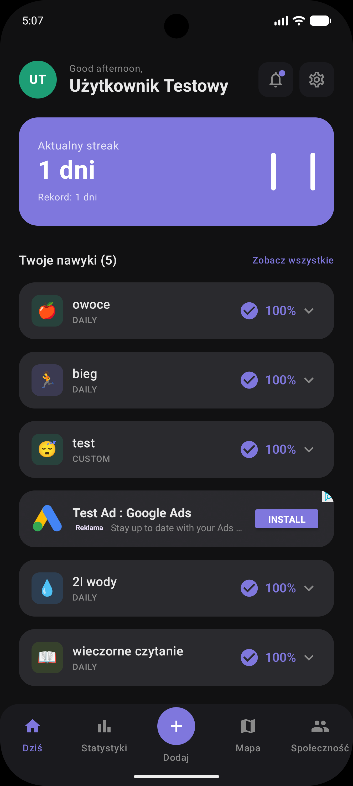
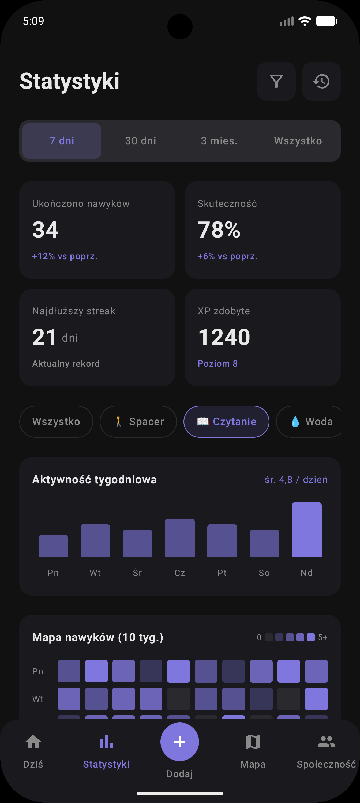

# Check. (NawykUZ)
## Check. to mobilny system zarządzania nawykami z elementami rywalizacji, nagradzający użytkowników za realizację ich celów. 

## Najważniejsze funkcje:
- Habit Battle - rywalizacja ze znajomymi
- System nagród i osiągnięć
- Statystyki i progres
- Śledzenie aktywności (mapa)
- Czat i społeczność

## Zrzuty ekranu:

  
  

### Założenia zrealizowane w aplikacji:
- Logowanie, rejestracja (z wykorzystaniem reCAPTCHA) i zarządzanie kontem użytkownika.
- Motyw jasny i ciemny, z możliwością wyboru koloru akcentu i dopasowania motywu do trybu urządzenia.
- Dwie wersje językowe: polska i angielska, z możliwością wyboru języka w ustawieniach.
- Zliczanie kroków
- Osiągnięcia i nagrody za realizację nawyków.
- Zintegrowane nieinwazyjne reklamy.
- Zapis danych do Firebase Firestore, z uwzględnieniem bezpieczeństwa danych i prywatności użytkowników.
- Zróżnicowane widżety na ekranie głównym, dostosowane do różnych potrzeb użytkowników.
- Moduł map, umożliwiający śledzenie aktywności oraz lokalizację użytkowników (z zachowaniem prywatności - dostęp dla znajomych).
- System habit battle, umożliwiający rywalizację ze znajomymi i motywujący do realizacji nawyków.

### Technologie:
- Kotlin + Jetpack Compose - do tworzenia interfejsu użytkownika.
- Firebase Firestore - do przechowywania danych użytkowników i nawyków.
- Firebase Authentication - do zarządzania kontami użytkowników.
- Firebase Cloud Messaging - do wysyłania powiadomień push.
- Firebase Functions - do obsługi logiki biznesowej i integracji z innymi usługami.
- Google Maps API - do implementacji modułu map.
- Google reCAPTCHA - do zabezpieczenia procesu rejestracji.
- AdMob - do integracji reklam w aplikacji.
- Material Design - do tworzenia estetycznego i intuicyjnego interfejsu użytkownika.
- Git - do zarządzania wersjami kodu i współpracy zespołowej.
- JUnit - do testowania jednostkowego logiki biznesowej aplikacji.
- Mockito - do tworzenia mocków i testowania interakcji między komponentami aplikacji
- Espresso - do testowania interfejsu użytkownika i zapewnienia jego poprawnego działania.

### Instalacja i uruchomienie:
1. Sklonuj repozytorium: `git clone`
2. Otwórz projekt w Android Studio.
3. Skonfiguruj Firebase dla projektu, dodając odpowiednie pliki konfiguracyjne i ustawienia.
   - utwórz projekt w Firebase Console
   - dodaj plik google-services.json do app/
   - włącz Authentication i Firestore
4. Zbuduj i uruchom aplikację na emulatorze lub fizycznym urządzeniu z Androidem.

### Autorzy:
- [Szpont Company](https://github.com/Szpont-Company)
  - [Jakub Grzesik](https://github.com/grzechu3o3)
  - [Dawid Bereś](https://github.com/Splasz)
  - [Hubert Jaskuła](https://github.com/hjaskula)
  - [Damian Janiak](https://github.com/Alfabeta0-0)